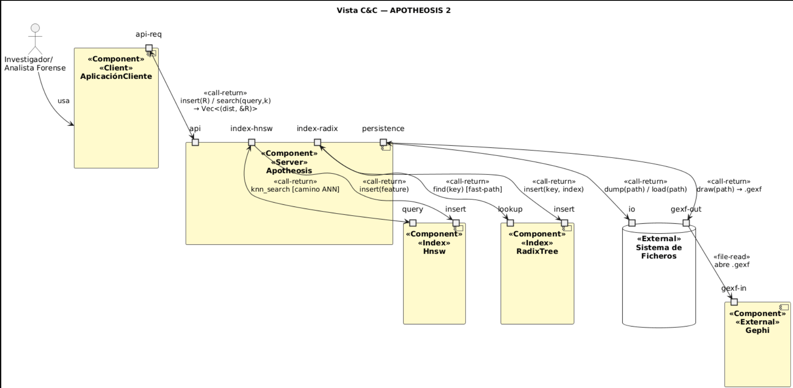
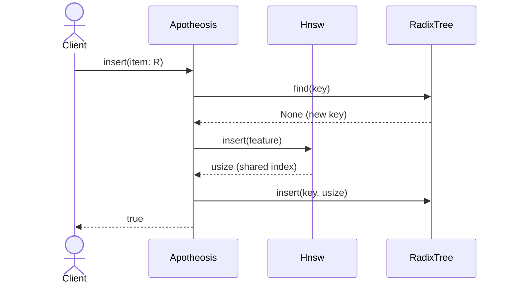
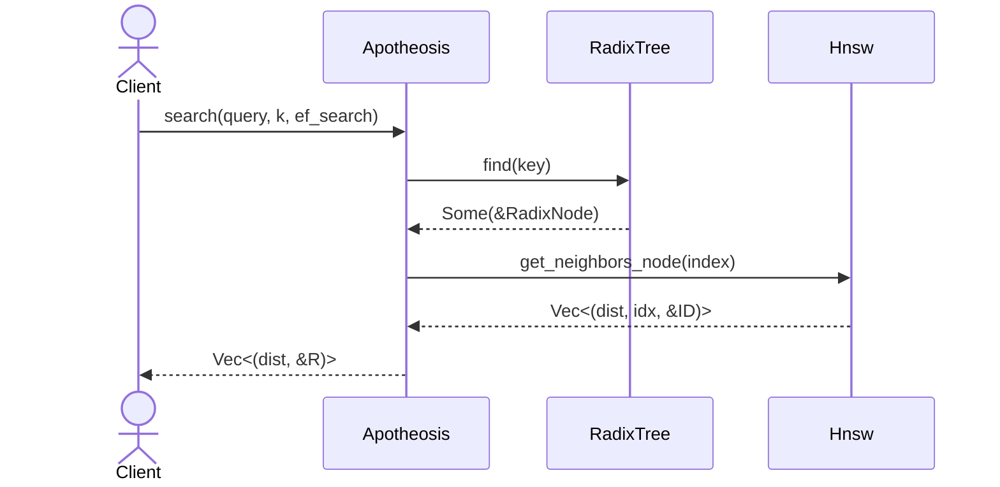
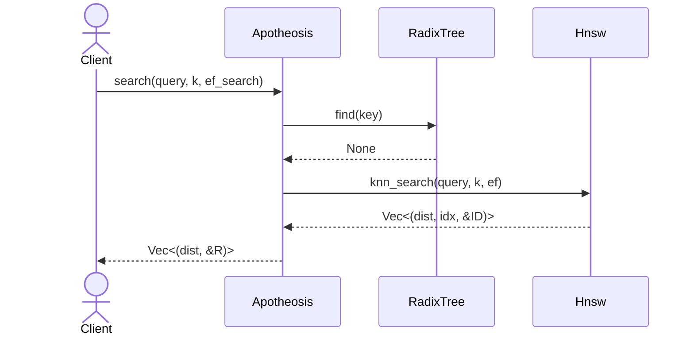

# Component and Connector View: APOTHEOSIS 2

## Table of Contents

1. [Primary Presentation](#1-primary-presentation)
   - 1.1 [Overview](#11-overview)
   - 1.2 [Legend](#12-legend)
2. [View Catalog](#2-view-catalog)
   - 2.1 [Elements and Properties](#21-elements-and-properties)
   - 2.2 [Relations and Properties](#22-relations-and-properties)
   - 2.3 [Element Interfaces](#23-element-interfaces)
   - 2.4 [Element Behavior](#24-element-behavior)

---

## 1. Primary Presentation

### 1.1 Overview
The diagram shows the system at runtime. The active elements are: ClientApplication, which initiates all interactions; Apotheosis, the single public entry point of the library; and the two internal indices Hnsw and RadixTree, coordinated by Apotheosis. The external elements FileSystem and Gephi appear in the context diagram but are not part of the library.

### 1.2 Legend

| Stereotype / Connector | Meaning in this diagram |
|---|---|
| `<<Client>>` | Component that initiates interactions (Client-Server style) |
| `<<Server>>` | Component that serves client requests |
| `<<Index>>` | Active algorithmic component with in-memory state. Not a passive store; it navigates structures and computes distances |
| `<<External>>` | Entity outside the library boundary |
| `<<call-return>>` | Synchronous procedure call with return. Bidirectional: the `<-->` arrow indicates request and response on the same connector |
| `<<file-read>>` | Asynchronous file read. The producer (FileSystem) and the consumer (Gephi) are not coupled at runtime |

## 2. View Catalog
### 2.1 Elements and Properties

#### ClientApplication
| Field | Content |
|---|---|
| Type | `<<Component>> <<Client>>` |
| Responsibility | Initiates all interactions with the library. Translates researcher needs into calls to the Apotheosis public API and presents the results. Not part of APOTHEOSIS 2. |
| Ports | `api-req`: output port from which it invokes `insert` and `search` |
| Implementation | External to the library. See context diagram in `vista-modulos.md` |

#### Apotheosis
| Field | Content |
|---|---|
| Type | `<<Component>> <<Server>>` |
| Responsibility | Public system facade. Single entry point at runtime. Receives client calls, decides which path each search takes (fast-path or ANN path), coordinates Hnsw and RadixTree keeping them synchronized, and handles persistence. GEXF export is performed by the `export::gexf` library function, which reads through this facade. |
| Ports | `api`: receives client calls (`insert`, `search`, `dump`, `load`, and the read accessors used by `export::gexf::draw`); `index-hnsw`: delegates ANN insertion and search to Hnsw; `index-radix`: delegates exact insertion and lookup to RadixTree; `persistence`: reads from and writes to FileSystem |
| Subarchitecture | Ports `index-hnsw`, `index-radix`, and `persistence` are internal ports delegated from the external port `api`. See interface delegation in section 2.3 |
| Module | `controllers/apotheosis.rs`; see `vista-modulos.md` |

#### Hnsw
| Field | Content |
|---|---|
| Type | `<<Component>> <<Index>>` |
| Responsibility | Approximate nearest-neighbor search index. Organizes elements in a multilayer graph and answers kNN queries by navigating from the top layers down to the base layer. Also supports direct neighbor retrieval by index, the mechanism used by Apotheosis in the fast-path. |
| Ports | `query`: receives kNN queries and returns `Vec<(distance, index, &ID)>`; `insert`: adds a new feature to the graph |
| Module | `controllers/hnsw.rs`; see `vista-modulos.md` |

#### RadixTree
| Field | Content |
|---|---|
| Type | `<<Component>> <<Index>>` |
| Responsibility | Exact-match index by byte key. Given an exact hash, determines in O(key length) whether the element already exists and returns its shared index. Enables the fast-path by avoiding HNSW graph traversal when the queried hash is already indexed. |
| Ports | `lookup`: receives a byte key and returns `Option<&RadixNode>` (Apotheosis extracts the index from the node's `data` field); `insert`: registers a new key with its shared index |
| Module | `controllers/radix_tree.rs`; see `vista-modulos.md` |

#### FileSystem
| Field | Content |
|---|---|
| Type | `<<External>>` |
| Responsibility | External persistent data store. Involved in `dump`/`load` to serialize and recover the full model, and in `export::gexf::draw` to write the `.gexf` files consumed by Gephi. |
| Ports | `io`: bidirectional read/write of the serialized model; `gexf-out`: output of the per-layer `.gexf` files to Gephi |

#### Gephi
| Field | Content |
|---|---|
| Type | `<<Component>> <<External>>` |
| Responsibility | External visualization tool. Opens the `.gexf` files produced by `export::gexf::draw()` for visual inspection of the HNSW graph. Not coupled at runtime with APOTHEOSIS 2; it consumes the files independently. |
| Ports | `gexf-in`: reads the `.gexf` files from FileSystem |

### 2.2 Relations and Properties

The course notes define *attachment* as the association between component ports and connector roles. An attachment is valid when ports and roles are compatible.

| Connector | Type | Caller end | Callee end | Data | Constraints |
|---|---|---|---|---|---|
| `cli↔apo` | `<<call-return>>` | `ClientApplication::api-req` | `Apotheosis::api` | Input: `insert(R)` → `bool` (`true` if inserted, `false` if key already exists) / `search(query, k, ef_search)` → `Vec<(dist, &R)>` | Synchronous. Apotheosis never initiates calls to the client |
| `apo↔hnsw-query` | `<<call-return>>` | `Apotheosis::index-hnsw` | `Hnsw::query` | Input: `knn_search(query, k, ef)` / Output: `Vec<(dist, idx, &ID)>` | Only active on the ANN path (RadixTree miss) |
| `apo→hnsw-insert` | `<<call-return>>` | `Apotheosis::index-hnsw` | `Hnsw::insert` | Input: `feature: ID` / Output: `usize` (node index in the graph, used by Apotheosis to register the key in RadixTree) | Executed on every new insertion |
| `apo↔radix-lookup` | `<<call-return>>` | `Apotheosis::index-radix` | `RadixTree::lookup` | Input: `key: &[u8]` / Output: `Option<&RadixNode>` (Apotheosis extracts `Option<usize>` from `node.data`). If `Some(index)`: fast-path; if `None`: ANN path | First operation in every `search()` call. Its result determines which path is taken |
| `apo→radix-insert` | `<<call-return>>` | `Apotheosis::index-radix` | `RadixTree::insert` | Input: `(key: Vec<u8>, index: usize)` / no return | Executed on every new insertion, always alongside `hnsw-insert` |
| `apo↔fs-io` | `<<call-return>>` | `Apotheosis::persistence` | `FileSystem::io` | `dump(path)` writes to FS; `load(path)` reads from FS into Apotheosis | Bidirectional. `load` reconstructs the full model in memory |
| `apo→fs-gexf` | `<<call-return>>` | `Apotheosis::persistence` | `FileSystem::gexf-out` | `export::gexf::draw(&model, path)` writes one `.gexf` file per HNSW layer with pattern `<stem>_layer<N>.gexf` | Write only. Returns `Result`: the first failed write or serialization aborts the export |
| `fs→gephi` | `<<file-read>>` | `FileSystem::gexf-out` | `Gephi::gexf-in` | `.gexf` file | Asynchronous with respect to APOTHEOSIS 2. Gephi opens the file independently; no runtime coupling |

### 2.3 Element Interfaces

Internal interfaces of Hnsw and RadixTree are documented in `vista-modulos.md`. Only the public interface of Apotheosis is documented here: the single port visible from outside the library.

---

#### Interface of Apotheosis `api` port

**1. Identity**
`api` port of the `Apotheosis` component. Single library entry point at runtime. Corresponds to the public methods of `controllers/apotheosis.rs` documented in `vista-modulos.md`; here the observable behavior is documented, not the implementation.

**2. Offered resources**

| Operation | Input | Output | Semantics |
|---|---|---|---|
| `insert(item: R)` | A record implementing `ApotheosisRecord` | `bool` | Inserts the element into both indices and the record vector. Returns `false` if the key already existed in the RadixTree (duplicate); `true` if inserted successfully |
| `search(query, k, ef_search)` | Query hash, number of desired results K, optional exploration factor | `Vec<(dist, &R)>` | Returns the K most similar elements sorted by ascending distance. Takes the fast-path if the hash exists in the RadixTree; ANN path via HNSW otherwise |
| `dump(path)` | File path | (none) | Serializes the full model (indices + records) to disk |
| `load(path)` | File path | (none) | Reconstructs the model from disk, restoring the synchrony invariant |
| `draw_model()`, `record(index)` | (none) / record index | Layer structure / `Option<&R>` | Read accessors; `export::gexf::draw` consumes them to export the HNSW graph as N `_layer<N>.gexf` files |

**3. Data types**
- `R`: generic type implementing `ApotheosisRecord`. Defined in `datalayer/record.rs`; see `vista-modulos.md`.
- `Vec<(dist, &R)>`: vector of tuples `(distance: u32, record reference)`.
- `ef_search`: `Option<usize>`. If `None`, the system's `EF` const-generic value is used.

**4. Constraints and errors**
- `insert` with a duplicate key does not modify system state; returns `false` without inserting.
- `load` overwrites in-memory state. Calling `load` on a system with existing data discards it.
- `search` on an empty system returns an empty `Vec`, no panic.

**5. Correspondence with Module View**
The five operations documented here correspond directly to the public methods of `Apotheosis<R, D, M, M0, EF, HEURISTIC>` in `vista-modulos.md`. The difference: the Module View documents the full Rust signature with const-generics; here the observable runtime behavior contract is documented.

### 2.4 Element Behavior

The course notes recommend sequence diagrams to document behavior. Three scenarios are documented: insertion plus the two paths that any `search()` call can take.

---

#### Scenario 1: Insertion

Two ordering constraints are critical: (1) `RadixTree::find` runs **first** - a duplicate is rejected before any mutation; (2) `Hnsw::insert` runs before `RadixTree::insert` - HNSW is the one that assigns the shared index, and the RadixTree must store that index. Reversing either constraint would break the synchrony invariant documented in `vista-modulos.md`.

---

#### Scenario 2: Fast-path search (RadixTree hit)

When the queried hash is already indexed, `Apotheosis` extracts the shared index from the `RadixNode` and retrieves neighbors directly from `Hnsw` without traversing the graph. Cost: O(key length) in the RadixTree plus a direct index lookup in Hnsw.

---

#### Scenario 3: ANN path search (RadixTree miss)

When the hash is not in the index, `Apotheosis` delegates to `Hnsw::knn_search`, which navigates the multilayer graph from the top layers down to the base layer to find the K nearest neighbors. Cost: sublinear in practice thanks to the HNSW structure.

---

## Related Documents

- [`docs/architecture/interfaz-apotheosis.md`](../../interfaz-apotheosis.md): the public API behind the `api` port documented here: full method signatures, error handling, and usage examples.
- [`docs/architecture/quality-attributes.md`](../../quality-attributes.md): documents the design drivers behind the runtime behavior shown in this view. Section §2.1 (performance) justifies the fast-path and the HNSW traversal; §5.1 explains the synchrony invariant that the insertion scenario (§2.4 Scenario 1) preserves.
- [`docs/architecture/directory.md`](../../directory.md): glossary and data dictionary for types appearing in this view (`Apotheosis`, `Hnsw`, `RadixNode`).
- [`docs/architecture/roadmap.md`](../../roadmap.md): audience guide and relationship between this view and the module and deployment views.
