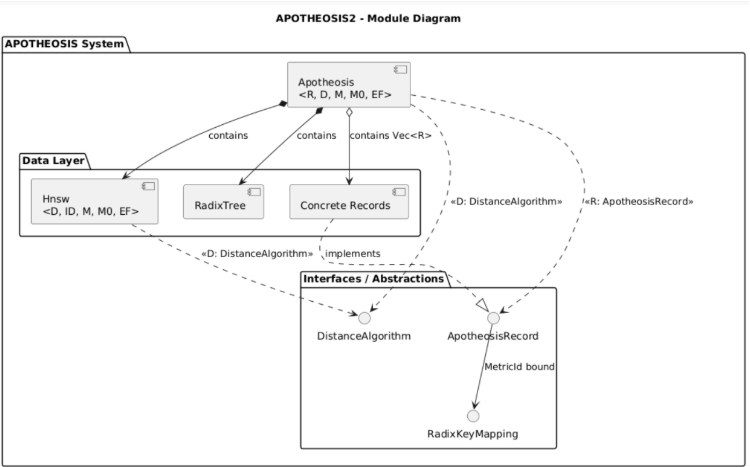
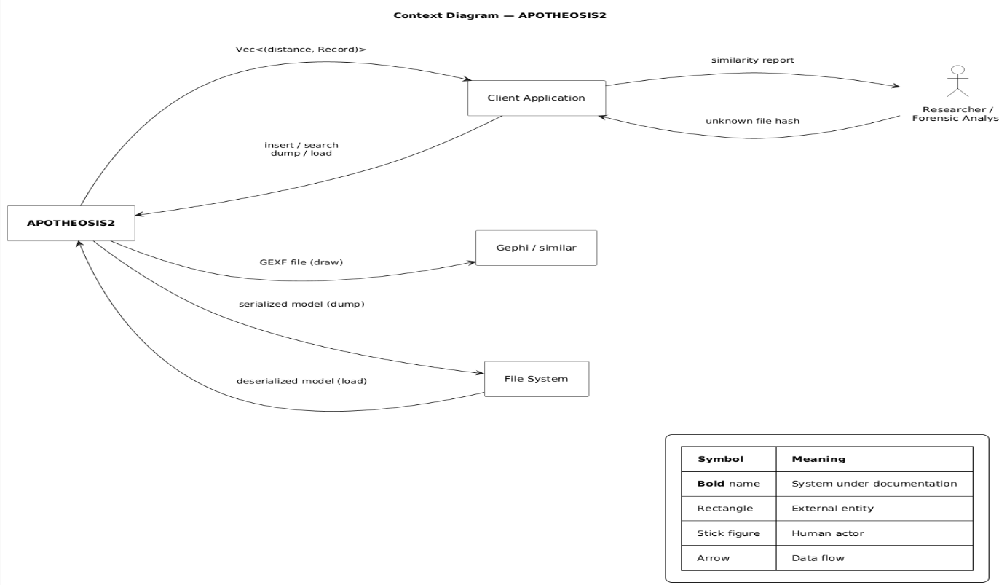

# Module View: APOTHEOSIS 2

## Table of Contents

1. [Primary Presentation](#1-primary-presentation)
   - 1.1 [Overview](#11-overview)
   - 1.2 [Components](#12-components)
2. [View Catalog](#2-view-catalog)
   - 2.1 [Elements and Properties](#21-elements-and-properties)
3. [Uses View](#3-uses-view)
4. [Context Diagram](#4-context-diagram)
5. [Variability Guide](#5-variability-guide)
6. [Design Rationale](#6-design-rationale)
7. [Behavior](#7-behavior)

---

## 1. Primary Presentation



### 1.1 Overview

Approximate nearest-neighbor search system by similarity (primarily TLSH). The system combines an HNSW graph and a Radix Tree, coordinated by `apotheosis.rs`.

### 1.2 Components

#### Data Layer: pure abstractions, no algorithms

**`algorithms.rs`**: defines what "distance" means between two elements. It is a contract: given a metric (number, TLSH hash...), anyone can implement how similar two values are. The system does not impose a single similarity criterion.

**`nodes.rs`**: structure of an HNSW graph node. Stores data only: which neighbors it has, at what distance, and which elements it points to. No business logic here.

**`record.rs`**: defines what an indexable element is. Any data type that enters APOTHEOSIS must fulfill two contracts:

- `ApotheosisRecord`: expose a metric identifier (the value used to compute similarity).
- `RadixKeyMapping`: optionally, expose an exact key for direct lookup.

#### Controllers: the algorithms

**`radix_tree.rs`**: exact-match index. Given an exact hash, finds immediately whether that element exists and where. If the hash is already known, no similarity search is needed.

**`hnsw.rs`**: approximate search index. Organizes elements in a multilayer graph where nearest neighbors are connected. Search starts at the top layers (global view, long jumps) and narrows down to the base layer (local view, precision). Result: finds the K most similar without comparing against all.

**`apotheosis.rs`**: system facade. Single public entry point. Coordinates the two indices and the record store, keeping them synchronized. Also handles persistence (save/load model to disk). GEXF export for visualization lives in `export/gexf.rs` and consumes the facade through its public read API.

---

## 2. View Catalog

### 2.1 Elements and Properties

#### `datalayer/algorithms.rs`

| Field | Content |
|---|---|
| Responsibility | Define the distance contract between two metric values. No business logic or side effects. |
| Public structs/traits | `DistanceAlgorithm<ID>`: single method `calculate_distance(&self, a: &ID, b: &ID) -> u32` |
| Public methods | `calculate_distance` (defined by the trait; implemented in each struct) |
| External dependencies | `tlsh2` |
| Configuration parameters | N/A |

#### `datalayer/nodes.rs`

| Field | Content |
|---|---|
| Responsibility | Represent an HNSW graph node: its neighbors, distances, and layer pointers. No algorithms. |
| Public structs | `HnswNode<const N: usize>` generic over maximum neighbor count (`N = M` in upper layers, `N = M0` in layer 0) |
| `HnswNode` fields | `next_node: u32`, `feature_index: u32`, `neighbors: [u32; N]`, `neighbor_distances: [u32; N]`, `neighbor_count: u16` |
| Public methods | `new_empty(feature_index, next_node)`, `active_neighbors() -> &[u32]`, `active_distances() -> &[u32]` |
| External dependencies | `serde` (const-generic array serialization via internal helper module) |
| Configuration parameters | `N` generic constant; in practice either `M` or `M0` depending on the layer |

#### `datalayer/record.rs`

| Field | Content |
|---|---|
| Responsibility | Define what an indexable element is: the metric identity contract (`ApotheosisRecord`) and the exact-key contract (`RadixKeyMapping`), plus concrete types for common use cases. |
| Public traits | `RadixKeyMapping`: `to_radix_key() -> Option<Vec<u8>>` (default: `None`); `ApotheosisRecord`: associated type `MetricId: Clone + RadixKeyMapping`, method `search_id() -> MetricId`, optional method `get_attributes() -> Vec<(String, String)>` |
| Public structs | `SimpleRecord<ID>`, `GenericJsonRecord` (TLSH + generic JSON metadata), `FileRecord` †, `WinModuleRecord`, `BinaryRecord` ‡. `SimpleRecord<ID>`, `GenericJsonRecord`, `WinModuleRecord` and `BinaryRecord` implement `ApotheosisRecord`. `FileRecord` does not (not indexable). |
| Public type aliases | `SimpleNumberRecord = SimpleRecord<u32>`, `SimpleTlshRecord = SimpleRecord<TlshDefault>` |
| External dependencies | `tlsh2`, `serde_json` |
| Configuration parameters | N/A |

> **† `FileRecord` does not implement `ApotheosisRecord`** and cannot be passed to `Apotheosis::insert`. The struct is defined with 6 fields (`hash`, `filename`, `file_path`, `version`, `size`, `timestamp`) but lacks a trait implementation; it is not indexable in the current state of the code.

> **‡ `BinaryRecord::get_attributes()`** returns a stub with an empty value: `vec![("version_names".to_string(), "".to_string())]`. GEXF export of `BinaryRecord` instances will not include real metadata until the implementation is completed.

> **Known technical debt:** `get_attributes()` (a GEXF export concern) is embedded in the domain trait `ApotheosisRecord`. This violates separation of concerns.

#### `controllers/radix_tree.rs`

| Field | Content |
|---|---|
| Responsibility | Exact-match index by byte key. Locates in O(key length) whether a hash already exists in the system and retrieves its shared index. |
| Public structs | `RadixNode<K, V>`: generic prefix tree. Instantiated in the system as `RadixNode<u8, Option<usize>>` (key = hash bytes, value = shared index) |
| Public methods | `new(path, data)`, `insert(path, data) -> &mut Self`, `find(path) -> Option<&Self>` |
| External dependencies | `serde` |
| Configuration parameters | N/A |

#### `controllers/hnsw.rs`

| Field | Content |
|---|---|
| Responsibility | Implement the multilayer ANN index: feature insertion, approximate kNN search, and direct neighbor retrieval by index (fast-path). |
| Public structs | `Hnsw<D, ID, const M, const M0, const EF, const HEURISTIC>` |
| Public methods | `new()`, `insert(feature: ID) -> usize`, `initialize(insertion_level)` †, `knn_search(query, k, ef) -> Vec<(u32, usize, &ID)>`, `get_neighbors_node(index) -> Vec<(u32, usize, &ID)>`, `print_layers()`, `draw_model()` |
| External dependencies | `rand`, `libm`, `tracing` |
| Configuration parameters | `M`: max neighbors in upper layers; `M0`: max neighbors in layer 0; `EF`: exploration factor during construction and search; `HEURISTIC`: selects the neighbor-selection algorithm (`false` = greedy, `true` = heuristic). All four are const-generics resolved at compile time. |

> **† `initialize()` is public but is an internal initialization step.** It is called by `insert` only when the graph is still empty. Calling it on a populated graph appends a spurious node and leaves the structure inconsistent; it should not be part of the public surface.

#### `controllers/apotheosis.rs`

| Field | Content |
|---|---|
| Responsibility | Public system facade. Coordinates the two indices and the record store, guarantees the synchrony invariant, and exposes persistence. |
| Public structs | `Apotheosis<R, D, const M, const M0, const EF, const HEURISTIC>` |
| Public methods | `new()`, `insert(item: R) -> bool` (false if duplicate), `search(query, k, ef_search) -> Vec<(u32, &R)>`, `dump(path)`, `load(path)`, plus read accessors `len()`, `is_empty()`, `draw_model()`, `record(index)` |
| External dependencies | `bincode`, `serde`, `tracing` |
| Configuration parameters | Inherits `M`, `M0`, `EF` from `Hnsw`; `ef_search` in `search()` is optional at runtime. |

#### `export/gexf.rs`

| Field | Content |
|---|---|
| Responsibility | GEXF visualization export. Builds one GEXF file per HNSW layer from the facade's public read API. |
| Public structs | (none) |
| Public methods | `draw(model, path)` |
| External dependencies | `gexf` |
| Configuration parameters | (none) |

---

## 3. Uses View

The uses view documents the real import relationships between modules, extracted directly from the source code. A "X uses Y" relationship exists when X imports types, traits, or functions from Y in its `use` statements or in the signatures of its public elements.

### 3.1 Usage Relationships Table

| Using module | Used module | What it imports | Purpose |
|---|---|---|---|
| `controllers/apotheosis.rs` | `controllers/hnsw.rs` | `Hnsw<D, R::MetricId, M, M0, EF, HEURISTIC>` | `hnsw` field of the struct; delegates `insert`, `knn_search`, `get_neighbors_node`, `draw_model` |
| `controllers/apotheosis.rs` | `controllers/radix_tree.rs` | `RadixNode<u8, Option<usize>>` | `radix` field of the struct; delegates `find`, `insert` |
| `controllers/apotheosis.rs` | `datalayer/algorithms.rs` | `DistanceAlgorithm<R::MetricId>` | Generic bound on parameter `D` |
| `controllers/apotheosis.rs` | `datalayer/record.rs` | `ApotheosisRecord`, `RadixKeyMapping` | Bound on `R`; calls `search_id()`, `to_radix_key()`, `get_attributes()` |
| `controllers/hnsw.rs` | `datalayer/algorithms.rs` | `DistanceAlgorithm<ID>` | Bound on `D`; calls `calculate_distance()` on every node comparison |
| `controllers/hnsw.rs` | `datalayer/nodes.rs` | `HnswNode<M>`, `HnswNode<M0>` | Nodes of `upper_layers` and `zero_layer` respectively |
| `export/gexf.rs` | `controllers/apotheosis.rs` | `Apotheosis` | Calls `draw_model()` and `record()` to read the graph structure and node attributes |
| `export/gexf.rs` | `datalayer/record.rs` | `ApotheosisRecord` | Bound on `R`; calls `get_attributes()` |
| `controllers/radix_tree.rs` | (none) | (none) | No internal project dependencies |
| `datalayer/algorithms.rs` | (none) | (none) | No internal project dependencies |
| `datalayer/nodes.rs` | (none) | (none) | No internal project dependencies |
| `datalayer/record.rs` | (none) | (none) | No internal project dependencies |

### 3.2 No Layer Violations

The architecture defines two layers: `datalayer` (pure abstractions) and `controllers` (algorithms). The allowed dependency direction is `controllers → datalayer`. No module in `datalayer` imports anything from `controllers`. The lower layer is fully independent: it can be compiled, tested, and reasoned about without knowing `controllers` exists.

### 3.3 Isolation Between `hnsw.rs` and `radix_tree.rs`

`hnsw.rs` and `radix_tree.rs` do not import each other. Neither knows the other exists. Only `apotheosis.rs` imports both and coordinates them. This has a direct architectural consequence: **the synchrony invariant** (every element present in HNSW has exactly one corresponding entry in the RadixTree with the same shared index) **can only be broken or maintained in `apotheosis.rs`**. Each index is correct independently; `apotheosis.rs` is the only point where synchrony between them can be broken or maintained.

### 3.4 Lateral Dependencies Within `controllers`

`apotheosis.rs` depends on `hnsw.rs` and `radix_tree.rs`, but not the other way around. These lateral dependencies do not constitute a layer violation, but they are asymmetric: `apotheosis` knows the other two; they do not know `apotheosis` or each other.

---

## 4. Context Diagram


APOTHEOSIS 2 is a Rust library: it has no user interface or process of its own. All access goes through a client application that integrates the library as a dependency and calls the public API (`insert`, `search`, `dump`, `load`).

The diagram shows four external entities:

- **Forensic researcher/analyst**: human actor who provides hashes of unknown files and consumes the similarity report, but never interacts directly with APOTHEOSIS 2.
- **Client application**: intermediary that translates the researcher's needs into library calls and presents the results as `Vec<(distance, Record)>`.
- **File system**: involved in persistence operations. `dump` serializes the full model to disk; `load` restores it, allowing reuse of a previously built index without reinserting all records.
- **Visualization tool** (Gephi or similar): consumes the GEXF file produced by `draw`, which exports the HNSW graph for visual inspection of the index.

---

## 5. Variability Guide

Following the terminology of Clements et al. (*Views and Beyond*, §6.4), variability points are places in the architecture where something can change without changing the architecture itself.

APOTHEOSIS 2 has four variability points, all with *binding time* at compile time via the Rust type system (const-generics and traits). There is no runtime variability.

### Variability point 1: `M`, upper layer connectivity

Const-generic parameter of `Hnsw` and `Apotheosis`. Controls the maximum number of neighbors per node in the upper layers of the graph. Any positive integer is valid; in practice, values between 8 and 48. Higher values improve search quality at the cost of more memory and construction time.

### Variability point 2: `M0`, base layer connectivity

Const-generic parameter of `Hnsw` and `Apotheosis`. Controls the maximum number of neighbors in layer 0, where all elements reside. Conventionally set to `2*M`. Determines the density of the highest-precision layer.

### Variability point 3: `EF`, exploration factor

Const-generic parameter of `Hnsw` and `Apotheosis`. Size of the candidate list during construction and search. Controls the precision/speed tradeoff: higher `EF` means more exhaustive search and higher computational cost.

### Variability point 4: `D`, injectable distance metric

Generic parameter of `Hnsw` and `Apotheosis`. `D` can be any type implementing `DistanceAlgorithm<R::MetricId>`, a trait defined in `datalayer/algorithms.rs` with a single method `calculate_distance(&self, a: &ID, b: &ID) -> u32`. The system ships two concrete implementations: `TlshDistance` (TLSH distance between two `TlshDefault` values via `diff()` from the `tlsh2` crate) and `NormalDistance` (absolute difference between two `u32` values). Any metric space can be injected by implementing the trait without modifying the core. *Binding time* is at compile time; the compiler specializes the graph for the concrete metric. The three const-generics `M`, `M0`, and `EF` are independent of `D`: the same graph works with any distance.

---

## 6. Design Rationale

The decisions below are stubs. The fully argued rationale for each, including the motivating requirement, the adopted solution with source-level evidence, and the trade-offs accepted, is consolidated in [`docs/architecture/quality-attributes.md`](../../quality-attributes.md). Read that document first; the stubs here exist as placeholders for any module-specific detail that does not fit the quality-attribute framing.

### Decision 1: Combination of two complementary indices

**Context:** The system needs to find the K most similar elements to a given hash in a collection of millions of records efficiently.

**Decision:**

> TODO

**Alternatives considered:**

> TODO

---

### Decision 2: Injectable distance function via `DistanceAlgorithm<>` trait

**Context:** Similarity computation could be hardcoded to TLSH, which is the primary use case.

**Decision:**

> TODO

**Alternatives considered:**

> TODO

---

### Decision 3: Shared index between `features[]` and `zero_layer`

**Context:** HNSW maintains two parallel structures internally: `features[]` (the metric values) and `zero_layer` (the base-layer graph nodes). Each inserted element occupies a position in both. The question is whether those positions should be managed with independent identifiers or a single shared index.

**Decision:**

> TODO

**Alternatives considered:**

> TODO

---

### Decision 4: `M`, `M0`, `EF` as compile-time const-generics

**Context:** The parameters controlling HNSW graph behavior (connectivity, exploration factor) could be configurable at compile time or at runtime.

**Decision:**

> TODO

**Alternatives considered:**

> TODO

---

## 7. Behavior

Traces of `search` and `insert` extracted from `controllers/apotheosis.rs`.

---

### 7.1 Trace of `search(query, k, ef_search)`

**Signature:** `fn search(&self, query: &R::MetricId, k: usize, ef_search: Option<usize>) -> Vec<(u32, &R)>`

#### Step 1: Resolve exploration factor

```
ef_search ← ef_search.unwrap_or(24)
```

If the caller does not provide `ef_search`, a fixed library default is used (see the interface document). This controls search exhaustiveness in the HNSW graph: higher values increase precision at the cost of more search time.

#### Step 2: Path decision (fast-path vs. ANN path)

The system asks the query type whether it can produce an exact key for the RadixTree:

```
if query.to_radix_key() == Some(key):
    if radix.find(key) == Some(node):
        if node.data == Some(Some(node_index)):
            → FAST-PATH: hnsw_results ← hnsw.get_neighbors_node(node_index)
        else:
            → ANN PATH: hnsw_results ← hnsw.knn_search(query, k, ef_search)
    else:
        → ANN PATH: hnsw_results ← hnsw.knn_search(query, k, ef_search)
if query.to_radix_key() == None:
    → ANN PATH: hnsw_results ← hnsw.knn_search(query, k, ef_search)
```

**Fast-path** (RadixTree hit): the hash is already indexed. Graph traversal is skipped; neighbors are retrieved directly by their index in layer 0. Cost: O(key length) in the RadixTree plus a direct lookup into `zero_layer[node_index]`.

**ANN path** (RadixTree miss or metric without exact key): the HNSW graph is navigated from the top layers down to layer 0, maintaining a candidate list of size `ef_search`. Cost: sublinear in practice.

In both cases `hnsw_results` has type `Vec<(u32, usize, &R::MetricId)>`: tuples of `(distance, shared_index, &metric)`.

#### Step 3: Sort, truncate, and translate shared index to full record

```
hnsw_results.sort_by_key(|(distance, _, _)| distance)
hnsw_results
    .take(k)
    .map(|(distance, index, _metric)| (distance, &records[index]))
    .collect()
```

This step runs the same way regardless of which path produced `hnsw_results`: both the fast-path and the ANN path get sorted by ascending distance and truncated to `k` before the shared index is translated into a full record reference. The metric itself is discarded; the caller receives `(distance, &R)`, not the internal HNSW representation.

---

### 7.2 Trace of `insert(item)`

**Signature:** `fn insert(&mut self, item: R) -> bool`

#### Step 1: Duplicate check (fast rejection before any mutation)

```
radix_key ← item.search_id().to_radix_key()
if radix_key == Some(key) AND radix.find(key) != None:
    tracing::warn!("Key already exists in radix tree")
    → return false
```

If the metric type produces an exact key (`to_radix_key()` returns `Some`) and that key is already present in the RadixTree, `false` is returned immediately. No structures are mutated. This check happens **before** HNSW insertion, preserving the synchrony invariant: a rejected element never enters any of the three structures.

If `to_radix_key()` returns `None`, there is no exact key and no duplicate check; the insert always continues to step 2.

#### Step 2: HNSW insertion

```
hnsw_node_index ← hnsw.insert(item.search_id())
```

Only reached for non-duplicate items. HNSW assigns an index to the new element and incorporates it into the multilayer graph. `hnsw_node_index` is the shared index that will synchronize all three structures.

#### Step 3: RadixTree registration and record storage

```
radix.insert(key, Some(hnsw_node_index))   (only if radix_key is Some)
records.push(item)
return true
```

The record is added to `records[]` at position `hnsw_node_index`, the same index used by HNSW and RadixTree.

#### Synchrony invariant after successful insertion

At the end of an `insert` that returns `true`, all of the following hold simultaneously:
- `hnsw.features[hnsw_node_index]` contains `item.search_id()`
- `radix.find(key).data == Some(Some(hnsw_node_index))` (if the metric has an exact key)
- `records[hnsw_node_index] == item`

## Related Documents

- [`docs/architecture/interfaz-apotheosis.md`](../../interfaz-apotheosis.md): the public methods documented here (`insert`, `search`) with full signatures, error handling, and usage examples.
- [`docs/architecture/quality-attributes.md`](../../quality-attributes.md): design drivers behind the module decomposition and the trade-offs summarized as stubs in section 6.
- [`docs/architecture/directory.md`](../../directory.md): glossary and data dictionary for the types cataloged in this view.
- [`docs/architecture/roadmap.md`](../../roadmap.md): audience guide and relationship between this view and the C&C and deployment views.
